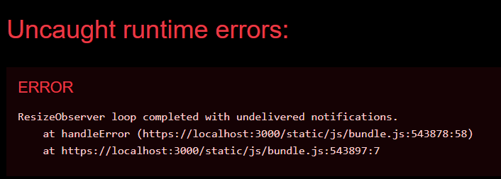

# Error report for react-virtuoso

## Steps

1. Use the npm start script to run the app.
2. Open the app in the browser.
3. You should see the webpack error overlay appear for a quick second and then disappear.
   
